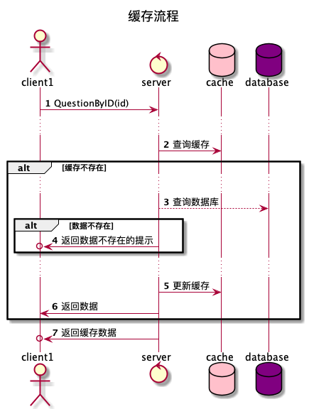
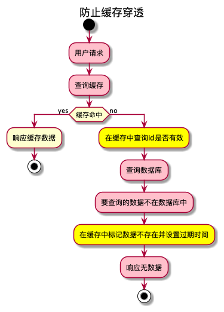
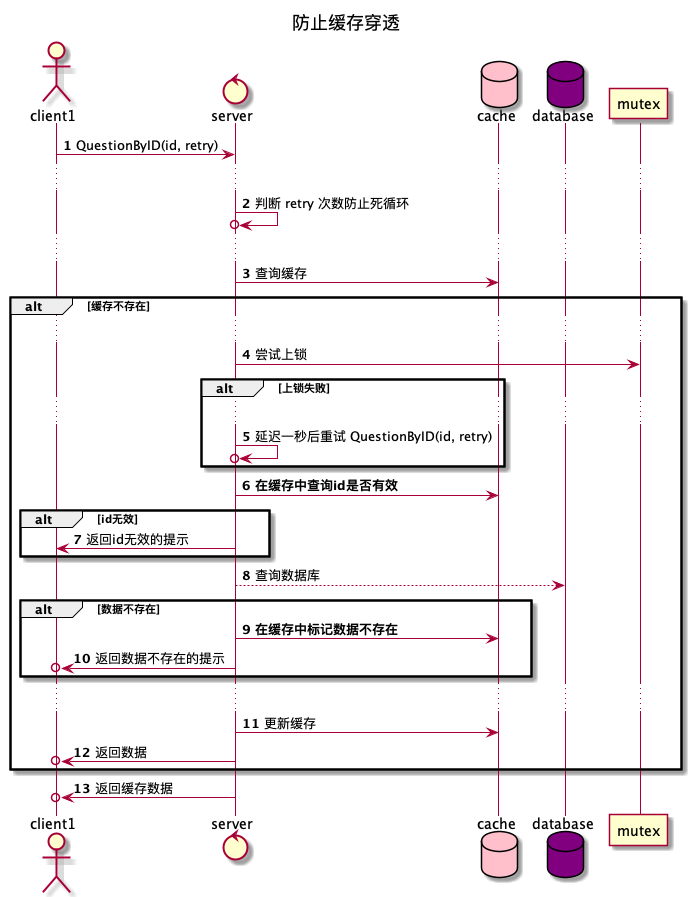
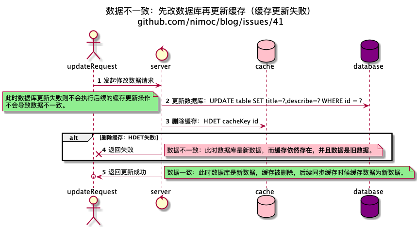

----

title: Redis实践
date: 2021-02-27
tags: 后端
keywords: 缓存实践,边路缓存,缓存击穿
description: 使用 redis 作为缓存的实战经验
issues: 41
----

# Redis实践

[](https://nimo.fun/notice/)

## Cache Aside（边路缓存）

### 不使用缓存

例如我们在开发提问系统，提问访问量非常大，每秒一万次访问。

最开始的伪代码如下：

```javascript
function QuestionByID(id) {
  row = SQLQuery("SELECT title, describe FROM question WHERE id = ? LIMIT 1")
  if row == null {
    return {
      type: "fail",
      msg : "数据不存在"，
    }
  }
  return {
    title: row.title,
    describe: row.describe,
  }
}
```

上线后发现数据库压力过大，服务延迟非常高，

## 缓存三问

实现缓存时需要先思考几个问题：

1. **KEY_VALUE**: 缓存的数据结构和 `key` 是什么？

以 redis 为例，有 `strings` `hashes` `lists` `sets` `sorted sets` 等常用数据结构，首先需要熟悉这些数据结构，了解各种操作的时间复杂度，尽可能的选择O(1),为了保证 redis 高速也要考虑数量非常大时如何合理的制定 key 和数据结构。

2. **TTL**:缓存过期时间是多少？


可以从以下几个时间维度考虑
1. 1s
2. 10s
3. 30s
4. 1m
5. 10m
6. 30m
7. 1h
8. forever

在性能角度最理想的是 forever 永不过期。但是在实际工作中如果设置为永久一旦出现缓存与数据不一致，会导致数据永久不一致。并且永不过期的缓存也会持续占用内存空间。

设置为 1s 则在大部分场景下导致缓存创建完成后还没怎么命中就已经失效了，缓存命中率过低导致缓存没有发挥高速访问的价值。
缓存的过期时间并不能算出一个准确的数值，一般都是一个大概的范围。

最小时间为：

**高并发时数据库访问限制**

比如在提问详情的缓存场景下缓存时间为 10s，当10秒只对数据库访问一次时候缓存能降低数据库的压力并且提高服务的响应速度。

只要你觉得合适 设置为 5s 1m 都是可以的，没有绝对的标准。不要过于纠结这个时间。在线上环境观测服务性能对缓存做出调整才能找出最完美的时间。

最大时间为：

**出现数据不一致时可以接受的时间**

当我们希望缓存尽可能长时候，可能会设置1天。如果出现了数据库更新了，但是删除缓存时失败。会导致一整天数据都不一致。如果时间设置的短一点，则数据不一致的时间会小很多。
比如设置为 10s 时如果出现数据不一致只会导致 10s 的数据不一致。

永不过期：

有些特殊创建下会设置永不过期，需要你根据业务场景自己考虑判断。缓存出现大量永不过期会导致内存空间越来越小。接受小概率宕机导致的数据丢失，要求高速读写，可以永久存储在 Redis 。

3. **REFRESH**: 数据更新后缓存如何清除？

一般情况下，在数据更新后应该立即删除缓存，让数据再次被访问时触发缓存同步的业务逻辑代码。

一种特殊情况是数据更新后不需要清除缓存，因为缓存的不是数据id。可能是一些动态的搜索条件作为key,这样的场景无法快速准确的找到要删除的 key，如果删除全部缓存。会导致缓存雪崩。此时缓存必须设置一个合理的较短的过期时间，已减少数据修改后缓存与数据不一致。


## 使用缓存

为了解决次问题，使用缓存减少频繁的 sql 操作。

缓存设计方式如下：

```
第一个请求：查询缓存 > 缓存不存在 > 查询数据库 > 将数据写入缓存 > 响应数据
第二个请求：查询缓存 > 缓存存在 > 响应数据
```




修改后的伪代码如下：
```js
function QuestionByID(id string) {
  // ++++++++++++++++++++++++++++++++
  cacheKey = "question"
  cache = Redis("HGETALL", cacheKey, id)
  if (cache) {
    // 因为 redis 不支持对 hash 的 field 设置过期时间，所以通过被动检查的方式删除
    if (cache.expire_at_uinx_millisecond >= nowMillisecond()) {
      Redis("HDEL", cacheKey, id)
      cache = nill
    }
  }
  // ++++++++++++++++++++++++++++++++

  // 判断缓存是否存在
  if (cache == nil) {
    // 查询数据库
    row = SQLQuery("SELECT title, describe FROM question WHERE id = ? LIMIT 1")
    if row == null {
      return {
        type: "fail",
        msg : "数据不存在"，
      }
    }
    // ++++++++++++++++++++++++++++++++
    // 将数据库的数据同步到缓存
    cache = row
    // 缓存过期时间 10s
    cahce.expire_at_uinx_millisecond = nowMillisecond() + 1000 * 10
    Redis("HSET", cacheKey, id,  jsonToString(row))
    // ++++++++++++++++++++++++++++++++

    // 响应数据
    return {
      title: cache.title,
      describe: cache.describe,
    }
  }
  // 响应缓存数据
  return {
    title: cache.title,
    describe: cache.describe,
  }
}
```


### 缓存击穿

重新发布后，数据库压力大幅度减少。但部分新问题发布后还是会出现几秒短暂的sql连接数暴增。

原因是一些粉丝量很大的用户发布提问后大量用户涌入，在缓存还没来得及同步时出现大量sql查询。这种情况叫**缓存击穿**

为了解决这种情况，需要使用分布式互斥锁避免出现一个提问出现大量同步缓存操作。

> 分布式互斥锁需要保证上锁和解锁都是原子性，在解锁时不要意外的解锁了其他线程/协程/机器上的锁和处理解锁时锁过期。本文不深入互斥锁。[互斥锁文章](https://github.com/search?q=user%3Animoc+%E4%BA%92%E6%96%A5%E9%94%81)


```
第一个请求：查询缓存 > 缓存不存在 > 尝试上锁 > 上锁成功 > 查询数据库 > 将数据写入缓存 > 响应数据
第一个请求：查询缓存 > 缓存不存在 > 尝试上锁 > 上锁失败 > 延迟1秒后重试查询
第二个请求：查询缓存 > 缓存存在 > 响应数据
```


修改后的伪代码如下：

```javascript

function QuestionByID(id string, retry int) {
  //为防止意外多次重试出现死循环，增加中断条件
  // ++++++++++++++++++++++++++++++
  if (retry > 2) {
    return {
      type: "fail",
      message: "提问获取失败，请重试。"
    }
  }
  // ++++++++++++++++++++++++++++++
  cacheKey = "question"
  cache = Redis("HGETALL", cacheKey, id)
  if (cache) {
    if (cache.expire_at_uinx_millisecond >= nowMillisecond()) {
      Redis("HDEL", cacheKey, id)
      cache = nill
    }
  }
  // 判断缓存是否存在
  if (cache == nil) {
    // 互斥锁
    // ++++++++++++++++++++++++++++++
    lockKey = "question_sync_cache:" + id lockSuccess,
    Unlock = Lock(lockKey, {
      ExpireSeconds: 3
    }) if (lockSuccess == false) {
      // 锁被占用时等待1秒
      SleepSeconds(1)
      // 再次调用 QuestionByID 重试查询，因为根据测试结果1秒的时间足够同步缓存完成。
      return QuestionByID(id, retry + 1)
    }
    // ++++++++++++++++++++++++++++++
    row = SQLQuery("SELECT title, describe FROM question WHERE id = ? LIMIT 1")
    if row == null {
      return {
        type: "fail",
        msg : "数据不存在"，
      }
    }
    cache = row
    cahce.expire_at_uinx_millisecond = nowMillisecond() + 1000 * 10
    Redis("HSET", cacheKey, id,  jsonToString(row))
    return {
      title: cache.title,
      describe: cache.describe,
    }
  }
  return {
    title: cache.title,
    describe: cache.describe,
  }
}
```


当有新提问被大量并发访问时，只有一个请求会进入查询 SQL的逻辑，其他请求会等待一秒后重试。如果第一个请求因为各种原因导致没有能成功更新缓存，还会有其他请求重新加锁并更新缓存。

在一种极端情况下：有出现大量的请求，成功上锁的那一个请求在上锁后因为各种原因线程中断了，导致没有解锁。此时会出现3秒内所有 QuestionByID 都不能响应数据。但这种情况出现的几率非常小，可根据业务场景来判断是否可以忽略。

### 缓存穿透

发布运行一段时间后一切正常，偶尔有一天发现当粉丝量很大的用户发布提问后又理解删除提问。发布提问时候推送消息已经推送到很多用户的手机中，用户阅读消息并点击访问提问。会进入如下流程：


如图所示，所有的用户请求都进入了红色框线路。即使在同步缓存时使用互斥锁去减少数据库压力。在第一个上锁成功的用户没查到数据并解锁后还会有新的用户上锁>查询数据库->响应无数据。这就导致了**缓存穿透**

> 数据不存在原因可能是正常删除，也可能是意外删除，也可能是恶意攻击。

为了解决缓存穿透，需要在查询到不存在的数据时在缓存中标记数据不存在，以避免缓存穿透。





```js
function QuestionByID(id string, retry int) {
  // （可暂时跳过这一段 if 代码）为防止意外多次重试出现死循环，增加中断条件
  if (retry > 2) {
    return {
      type: "fail",
      message: "数据获取失败，请重试。"
    }
  }
  cacheKey = "question:" + id cache = Redis("HGETALL", cacheKey, )
  //为防止意外多次重试出现死循环，增加中断条件
  if (retry > 2) {
    return {
      type: "fail",
      message: "提问获取失败，请重试。"
    }
  }
  cacheKey = "question"
  cache = Redis("HGETALL", cacheKey, id)
  if (cache) {
    if (cache.expire_at_uinx_millisecond >= nowMillisecond()) {
      Redis("HDEL", cacheKey, id)
      cache = nill
    }
  }
  // 判断缓存是否存在
  if (cache == nil) {

    // 在缓存中查询是否是无效数据
    // ++++++++++++++++++++++++
    invalidTime = Redis("HGET", "question_invalid", id)
    if (invalidTime > nowMillisecond()) {
      invalidTime =  false
      Redis("HDEL", "question_invalid", id)
    }
    if (invalid) {
      return {
        type: "fail",
        msg : "数据不存在"，
      }
    }
    // ++++++++++++++++++++++++

    // 互斥锁
    lockKey = "question_sync_cache:" + id lockSuccess,
    Unlock = Lock(lockKey, {
      ExpireSeconds: 3
    }) if (lockSuccess == false) {
      // 锁被占用时等待1秒
      SleepSeconds(1)
      // 再次调用 QuestionByID 重试查询，因为根据测试结果1秒的时间足够同步缓存完成。
      return QuestionByID(id, retry + 1)
    }
    row = SQLQuery("SELECT title, describe FROM question WHERE id = ? LIMIT 1")
    if row == null {

      // 标记无效数据
      // ++++++++++++++++++++++
      Redis("HSET", "question_invalid", id, nowMillisecond() + 1000 * 10)
      // ++++++++++++++++++++++

      return {
        type: "fail",
        msg : "数据不存在"，
      }
    }
    cache = row
    cahce.expire_at_uinx_millisecond = nowMillisecond() + 1000 * 10
    Redis("HSET", cacheKey, id,  jsonToString(row))
    return {
      title: cache.title,
      describe: cache.describe,
    }
  }
  return {
    title: cache.title,
    describe: cache.describe,
  }
}
```

> 如果数据的id是自增id这种已经被简单穷举递增的，则要注意如果有恶意攻击者递增id攻击。会导致第一秒因为查询无效某个id设为了无效（超时10s），第二秒有新数据创建，新数据的id刚好是这个id.此时就会导致新数据10s内无法被访问。所以是数字id应该将缓存过期时间设置的短一点，能防御恶意攻击即可。

当数据量非常大时 hash 存储无效id会导致缓存数据过大，可以使用[布隆过滤器](https://cn.bing.com/search?q=%E5%B8%83%E9%9A%86%E8%BF%87%E6%BB%A4%E5%99%A8) 降低缓存大小。可以根据实际情况选择合适的方式。

### 更新数据时同步缓存

更新数据时同步缓存,需要通过删除缓存从而让后续的用户请求触发同步缓存来实现。
如果直接设置缓存的值`HSET cacheKey ....` 在并发情况下非常容易出现数据不一致的问题。

先列出记住容易出现数据不一致的情况


> 另外一种错误的想法是用 SQL事务，而事务并不能解决此问题，[时序图说明](./cache_practice/1-6-2.png)。

---



---


伪代码
```js
func UpdateQuestion(id, data) {
  cacheKey = "question:" + id
  Redis("HDEL", cacheKey, id)
  SqlUpdate("UPDATE question SET title = ?, describe = ? WHERE id = ?")
  Redis("HDEL", cacheKey)
  // 消息队列要解耦，只发布提问数据被更新的消息，而不是发布删除缓存的命令。这样可以多个系统复用消息。
  MessageQueuePublish("questionUpdated", id)
}
```

---


伪代码
```js
func UpdateQuestion(id, data) {
  cacheKey = "question:" + id
  result = Redis("EXPIRE", cacheKey, sec)
  if result == 0 {
    // 增加监控日志，当大量出现设置失败，则表明需要当前业务场景下不适合用 TTL 延迟双删
    monitorLog("warn", "question update cache set ttl fail, key not exist" + cacheKey )
  }
  SqlUpdate("UPDATE question SET title = ?, describe = ? WHERE id = ?")

  // 消息队列要解耦，只发布提问数据被更新的消息，而不是发布删除缓存的命令。这样可以多个系统复用消息。
  MessageQueuePublish("questionUpdated", id)
}
```
---

因为缓存存储系统和持久化数据存储系统都是不同的服务提供的（mysql redis）所以无法保证原子性，无法保证原子性就无法保证数据一致。只能通过各种补偿机制保证数据最终一致性，在极端情况下依然无法保证数据一致性。但好在很多场景并不需要实现绝对的数据一致性，允许极端情况下出现短暂的数据不一致。比如在同步缓存的时候设置缓存10分钟，这样在极端情况下，也只会出现10分钟的缓存不一致。

消息队列延迟双删会增加系统复杂度，TTL 相对而言简单很多。**高并发和数据强一致性是鱼与熊掌不可兼得**，需掌握发现问题和解决的方法根据自己的业务场景做出选择和调整。


## 商品下单的缓存

上面介绍了提问这种几乎全部都是读的缓存机制，下面介绍在秒杀场景如何利用缓存做库存扣减。

库表设计：

```
table: goods
field: id,title,describe

table: goods_inventory
field: goods_id,inventory
```

因为 `inventory` 在下单时是热点数据读多写多，而 `title` `describe` 读多写少非常低。
所以将 `inventory` [水平分表](https://cn.bing.com/search?q=%E6%B0%B4%E5%B9%B3%E5%88%86%E8%A1%A8)。

`title`, `describe` 通过Cache Aside（边路缓存）实现，与question类似。

`inventory` 单独存储在缓存中，读缓存的同步策略与 question 实现一致。

当缓存存在时的缓存扣减逻辑如下：


伪代码

```js
func PlaceOrder(userID, goodsID, qurchaseQuantity) {
  deductSuccess = RedisLua(` if hget(cacheKey, id) { hincrby(cacheKey, id, qurchaseQuantity) ;return 1 } else {return0}`)
  if deductSuccess == false {
    return "下单失败，库存不够"
  }
  result = CreateOrder(user, goodsID, qurchaseQuantity)
  if result == null {
    result = Redis("HINCRBY", cacheKey, id, -qurchaseQuantity)
    if (result.fail) {
      // 增加监控日志，当大量出现日志，则表明代码或数据可能出现问题
      monitorLog("warn", "PlaceOrder HINCRBY qurchaseQuantity fail", result.fail)
    }
    return "下单失败"
  }
  return "下单成功"
}
```

> 此处缓存的作用类似于游乐园门口的票据预检员，百万个人必须通过预检员验证才能通过预检关口。预检员的小本子上记录了游乐园允许进入最大人数，每当进入一个人时候预检员将小本子上的数字递增，比如超过最大限制10万则剩下90万不允许进入。通过预检关口后游乐园闸机会进行严格耗时的票据验证，当闸机验证失败时会通知预检员进入数量进行递减。


在上图逻辑中，扣除缓存后如果进程意外中断，或退回库存失败。会导致数据短暂不一致，商品100件，最终只卖出98件。将server -> database的操作改成消息队列发布消息，则能减少这种错误的概率。（发布消息比数据库操作稳定性高）。虽然消息队列也可能失败导致现数据不一致，只需在最后进行补偿机制，确保最终数据一致即可。


> 防止 Redis 出现 hash 大 key 可以根据商品id取模，将库存分散存储。

> 秒杀下单需使用客户端限流->服务端限流->请求削峰->取消订单等一系列操作，本文不做展开


## UV 统计

标记用户已访问过使用 sets

```js
{
  "news_viewd:news_id:@newsID:user_id": {
    @userID,
    @userID,
  }
}
```

uv计数 使用 hashes

```js
{
  "news_uv": {
    "@newsID":  0,
    "@newsID":  1,
  }
}
```

```js
function news(userID, newsID) {
  viewdKey = "news_viewd:news_id:" + newsID + ":user_id:"
  addCount = Redis("SADD", viewdKey, userID)
  // 0 表示数据已经存在
  if (addCount == 0) {
    return
  }
  newsUVKey = "news_uv"
  Redis("HINCR", newsUVKey, userID)
}
```

> 如果 uv 按天统计，则在 key 中加上日期 `news_viewd:date:2020-11-11:news_id:1:user_id`, 如果需要清除数据，每日凌晨使用定时任务清除昨日数据即可。
> 如果 uv 是按一周统计则 key 中加上的是月份和第几周 "2000-02-1" (2020年二月份第一周)
> 如果 uv 是按n天计算一次，`"2000-" + ceil(date/n)` ，注意一年只有365天，当 n 为2时最后一个间隔是1，其他间隔都是2。如果需求方允许出现这个偏差，可以忽略。


sets hash 统计uv当数据量非常大时会占用非常大的空间。

这种情况下可以使用 [hyperloglogs](https://redis.io/topics/data-types-intro#hyperloglogs)。


```js
function news(userID, newsID) {
  hllKey = "news_viewd:news_id:" + newsID
  addCount = Redis("PFADD", hllKey, userID)
  // 0 表示数据已经存在
  if (addCount == 0) {
    return
  }
}
func newsUV(newsID) {
  hllKey = "news_viewd:news_id:" + newsID
  uv = Redis("PFCOUNT", hllKey)
  return uv
}
```

但要注意 HyperLogLog 会存在 0.81% 的误差，在数据不敏感的情况下 hyperloglogs 是个不错的选择。

原文地址 https://nimo.fun/cache_practice/ (原文保持持续更新和更多的评论)
