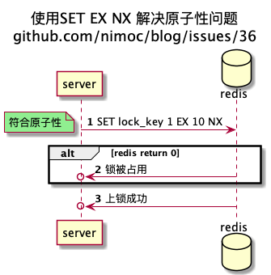
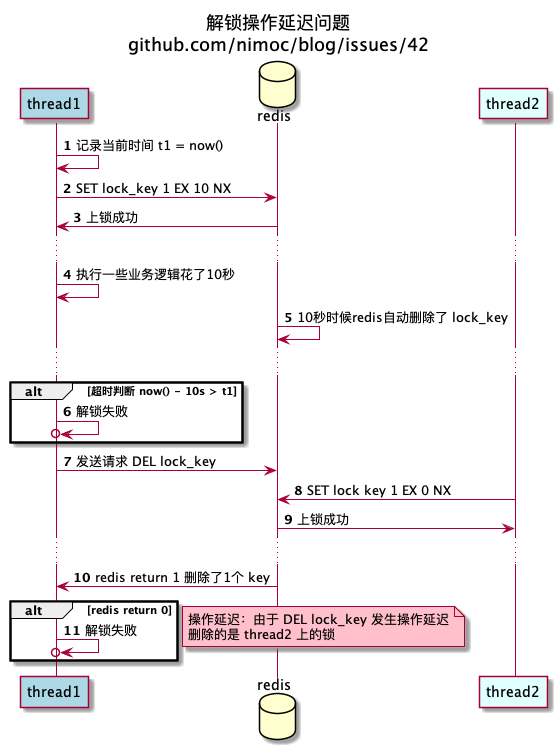
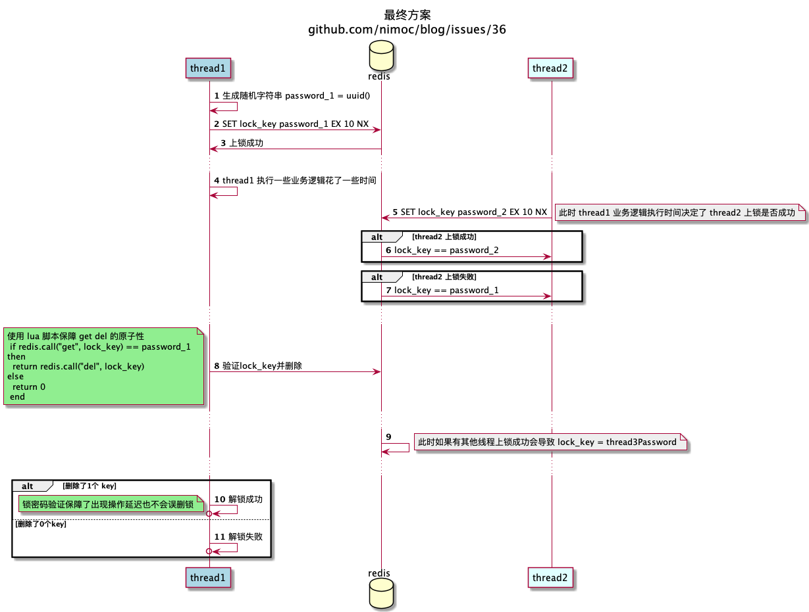

----
title: 解决并发方法论
date: 2021-02-27
tags:
- 后端
- 并发
issues: 42
----

# 解决并发方法论

首先记住以下几点

1. **原子性**：确认哪些操作不是原子性，考虑不是原子性会导致什么问题。并考虑所有操作都可能失败或进程/协程中断
2. **操作延迟**：代码中每个操作的执行时间都是不确定的。每一行之间都可能出现非常大的延迟，需假设每行代码之间都有 sleep 操作。网络io中客户端收到消息的时间距离服务端发送消息已经过了很久，需假设:0s client 发起请求-> 2s server 接收请求 -> 4s server 响应数据 -> 6s client 接收响应
3. **竞态**：考虑会有其他线程/协程/同一时间对数据进行修改
4. 通过时序图分析问题 https://plantuml.com/zh/

以 redis 互斥锁为案例实现上述方法论：

先看一下不严谨的上锁操作会产生的问题

可以通过 SET key value  EX seconds NX 保证原子性

上锁操作已经解决了原子性问题，接下来看不严谨的解锁操作会产生的问题

为了解决延迟导致的错误解锁，通过不严谨的超时判断解决问题

> 请先不要看红色注释框,自己分析存在的问题。然后查看红色注释框确认答案

在上锁时设置密码，在解锁时验证密码以避免删除了别人的锁

TODO:解锁失败后锁回滚，心跳续命锁，etcd分布式锁

原文地址 https://github.com/nimoc/blog/issues/42 (原文持续更新)
