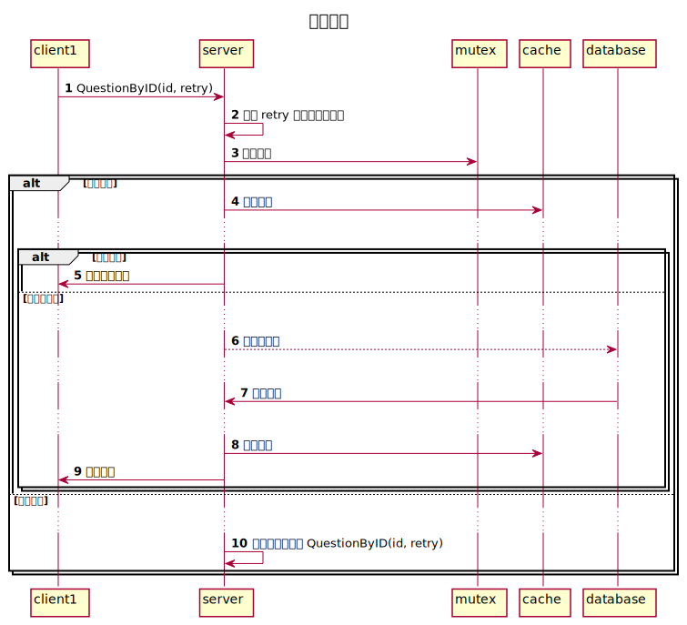

# 缓存实践

本文将完整介绍以下知识点：

1. 读多写少
2. 读多写多
3. 缓存与数据库的一致性


## 读多写少

例如我们在开发提问系统，提问访问量非常大，每秒一万次访问。

最开始的伪代码如下：

```javascript
function QuestionByID(id) {
  row = SQLQuery("SELECT title, describe FROM question WHERE id = ? LIMIT 1") return {
    title: row.title,
    describe: row.describe,
  }
}
```

上线后发现数据库压力过大，服务延迟非常高，

为了解决次问题，使用缓存减少频繁的 sql 操作。

缓存设计方式如下：

```
第一个请求：查询缓存 > 缓存不存在 > 查询数据库 > 将数据写入缓存 > 响应数据
第二个请求：查询缓存 > 缓存存在 > 响应数据
```

```sequence
@startuml
autonumber
title: 缓存流程
client1->server: QuestionByID(id)
server->cache: 查询缓存
...
alt 缓存存在
    server->client1: 返回缓存数据
else 缓存不存在
    ...
    server-->database: 查询数据库
    ...
    database->server: 返回数据
    ...
    server->cache: 更新缓存
    server->client1: 返回数据
end
@enduml
```


修改后的伪代码如下：

```javascript
function QuestionByID(id) {
  cacheKey = "question:" + id
  cache = Redis("HGETALL", cacheKey, )
  // 判断缓存是否存在
  if (cache == nil) {
    // 查询数据库
    row = SQLQuery("SELECT title, describe FROM question WHERE id = ? LIMIT 1")
    // 将数据库的数据同步到缓存
    Redis("HSET", cacheKey, "title", row.title, "describe", row.describe)
    // 响应数据
    return {
      title: cache.title,
      describe: cache.describe,
    }
  }
  // 响应缓存数据
  return {
    title: cache.title,
    describe: cache.describe,
  }
}
```

重新发布后，数据库压力大幅度减少。但部分新问题发布后还是会出现几秒短暂的sql连接数暴增。

原因是一些粉丝量很大的用户发布提问后大量用户涌入，在缓存还没来得及同步时出现大量sql查询。

为了解决这种情况，需要使用分布式互斥锁避免出现一个提问出现大量同步缓存操作。

> 分布式互斥锁需要保证上锁和解锁都是原子性，在解锁时不要意外的解锁了其他线程/协程/机器上的锁和处理解锁时锁过期。本文不深入互斥锁。[互斥锁文章](https://github.com/search?q=user%3Animoc+%E4%BA%92%E6%96%A5%E9%94%81)


```
第一个请求：查询缓存 > 缓存不存在 > 尝试上锁 > 上锁成功 > 查询数据库 > 将数据写入缓存 > 响应数据
第一个请求：查询缓存 > 缓存不存在 > 尝试上锁 > 上锁失败 > 延迟1秒后重试查询
第二个请求：查询缓存 > 缓存存在 > 响应数据
```




```sequence
@startuml
autonumber
title: 缓存流程
client1->server: QuestionByID(id, retry)
server->server: 判断 retry 次数防止死循环
server->mutex: 尝试上锁
alt 上锁成功
    server->cache: 查询缓存
    ...
    alt 缓存存在
        server->client1: 返回缓存数据
    else 缓存不存在
        ...
        server-->database: 查询数据库
        ...
        database->server: 返回数据
        ...
        server->cache: 更新缓存
        server->client1: 返回数据
    end
else 上锁失败
    ...
    server->server: 延迟一秒后重试 QuestionByID(id, retry)
end
@enduml
```


修改后的伪代码如下：

```javascript
function QuestionByID(id string, retry int) {
  // （可暂时跳过这一段 if 代码）为防止意外多次重试出现死循环，增加中断条件
  if (retry > 2) {
    return {
      type: "fail",
      message: "提问获取失败，请重试。"
    }
  }
  cacheKey = "question:" + id cache = Redis("HGETALL", cacheKey, )

  if (cache == nil) {
    // 互斥锁
    lockKey = "question_sync_cache:" + id lockSuccess,
    Unlock = Lock(lockKey, {
      ExpireSeconds: 3
    }) if (lockSuccess == false) {
      // 锁被占用时等待1秒
      SleepSeconds(1)
      // 再次调用 QuestionByID 重试查询，因为根据测试结果1秒的时间足够同步缓存完成。
      return QuestionByID(id, retry + 1)
    }

    row = SQLQuery("SELECT title, describe FROM question WHERE id = ? LIMIT 1") Redis("HSET", cacheKey, "title", row.title, "describe", row.describe) unlockSuccess = Unlock()
    // 解锁失败
    if (unlockSuccess == false) {
      // 再次调用 QuestionByID 重试查询
      return QuestionByID(id, retry + 1)
    }
    return {
      title: cache.title,
      describe: cache.describe,
    }
  }
  return {
    title: cache.title,
    describe: cache.describe,
  }
}
```

当有新提问被大量并发访问时，只有一个请求会进入查询 SQL的逻辑，其他请求会等待一秒后重试。如果第一个请求因为各种原因导致没有能成功更新缓存，还会有其他请求重新加锁并更新缓存。

在一种极端情况下：有出现大量的请求，成功上锁的那一个请求在上锁后因为各种原因线程中断了，导致没有解锁。此时会出现3秒内所有 QuestionByID 都不能响应数据。但这种情况出现的几率非常小，可根据业务场景来判断是否可以忽略。

至此同步缓存的代码写完了。

> 还需要注意缓存穿透的问题

接下来考虑当提问数据被修改时如何更新缓存。
